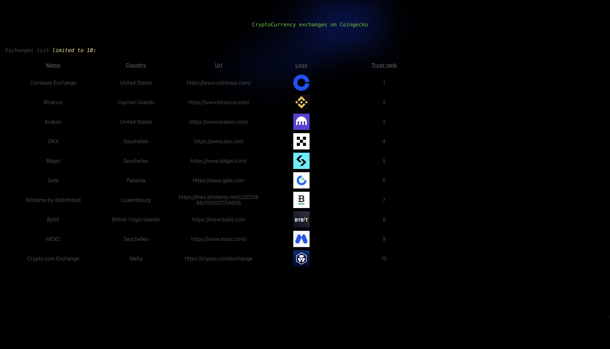
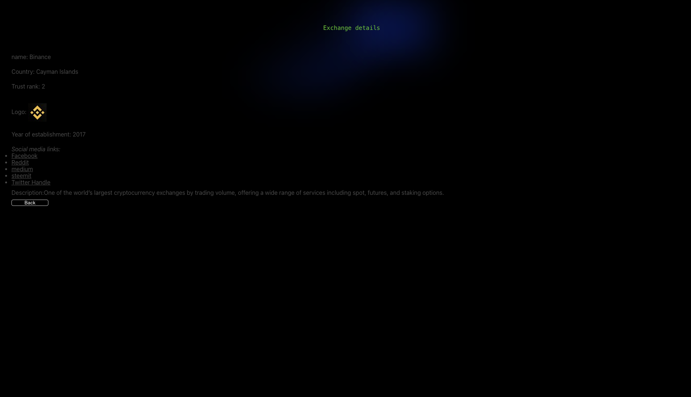

# Crypto Exchanges Directory

A responsive cryptocurrency exchange directory built with React and TypeScript, featuring real-time exchange data powered by the CoinGecko API and a tested end-to-end user experience with Cypress.

[Live Demo](#) · [Repository](#)

---

## ✨ Overview

Crypto Exchanges Directory is a responsive web application that allows users to explore cryptocurrency exchanges and view detailed information about individual platforms.

The application retrieves exchange data from the CoinGecko API and presents it through a clean, responsive interface with dedicated exchange detail pages.

The project was built with a focus on:

* Clean and maintainable React architecture
* Type-safe development with TypeScript
* Responsive UI across desktop and mobile devices
* Integration with a third-party cryptocurrency API
* Client-side navigation and dynamic exchange detail pages
* End-to-end testing of critical user journeys
* A focused and production-oriented project structure

---

## 📸 Preview

### Exchange Directory



The main page displays a curated list of cryptocurrency exchanges retrieved from the CoinGecko API.

### Exchange Details



Users can select an exchange to view its dedicated details page.

### Responsive Design


The interface is designed to provide a consistent experience across different screen sizes.

---

## 🎯 Key Features

* **Exchange Directory** — Displays cryptocurrency exchanges retrieved from CoinGecko.
* **Exchange Details** — Provides a dedicated page for each exchange.
* **Dynamic Routing** — Exchange pages are generated using their unique identifiers.
* **External API Integration** — Retrieves live exchange information from CoinGecko.
* **Responsive Interface** — Designed for desktop, tablet, and mobile layouts.
* **User Navigation** — Users can move between the directory and individual exchange pages.
* **End-to-End Testing** — Critical application flows are covered with Cypress.
* **TypeScript** — Provides static typing and improved maintainability.

---

## 🛠️ Tech Stack

### Frontend

* React
* TypeScript
* CSS

### Data & APIs

* CoinGecko API

### Testing

* Cypress
* Jest

### Development

* Node.js
* npm
* Git

---

## 🏗️ Application Architecture

The application follows a component-based React architecture with clear separation between the user interface, views, API communication, and testing layers.

```text
src/
├── components/
│   └── reusable UI components
│
├── views/
│   ├── directory/
│   └── cryptoExchangeDetails/
│
├── API / data layer
│
└── application entry point

cypress/
├── e2e/
│   ├── directory.cy.ts
│   └── user-journey.cy.ts
│
└── support/
    └── e2e.ts
```

> The structure above will be updated to match the final repository structure exactly.

---

## 🔌 API Integration

The application uses the CoinGecko API to retrieve cryptocurrency exchange data.

The directory retrieves a limited number of exchanges:

```text
GET /api/v3/exchanges?per_page=10
```

When a user selects an exchange, the application retrieves its detailed information using the exchange identifier:

```text
GET /api/v3/exchanges/{exchangeId}
```

This allows the interface to display current exchange information without maintaining a local static dataset.

---

## 🧭 User Journey

The primary user flow is:

```text
Exchange Directory
        ↓
Select an Exchange
        ↓
Exchange Details
        ↓
Back to Main Page
        ↓
Exchange Directory
```

This journey is also covered by an end-to-end Cypress test to verify that the application's navigation works as expected.

---

## 🧪 Testing

Testing focuses on validating the application's most important user-facing behavior.

### Cypress E2E Tests

The project currently contains two Cypress specifications:

```text
cypress/
└── e2e/
    ├── directory.cy.ts
    └── user-journey.cy.ts
```

### Directory Tests

The directory test suite verifies:

* Page titles are displayed correctly
* The exchange list is limited to 10 exchanges
* Selecting the first exchange navigates to its details page

### User Journey Test

The user journey test verifies the complete flow:

```text
Visit Directory
      ↓
Select First Exchange
      ↓
Verify Exchange Details
      ↓
Click "Back to Main Page"
      ↓
Verify Return to Directory
```

### Running Cypress

Open Cypress interactively:

```bash
npm run cypress:open
```

Run the complete E2E suite headlessly:

```bash
npm run cypress:run
```

Current E2E suite:

```text
4 tests
4 passing
0 failing
```

---

## 🧰 Getting Started

### Prerequisites

Make sure you have installed:

* Node.js
* npm
* Git

### Installation

Clone the repository:

```bash
git clone <repository-url>
```

Navigate into the project:

```bash
cd crypto-exchanges-directory
```

Install dependencies:

```bash
npm install
```

### Environment Variables

If the application requires environment variables, create a `.env` file based on the project's environment configuration.

```env
# Example
REACT_APP_API_KEY=your_api_key
```

> The exact environment variables will be documented here based on the final repository configuration.

### Start the Application

```bash
npm start
```

The application will be available at:

```text
http://localhost:3000
```

---

## 📜 Available Scripts

| Command                | Description                          |
| ---------------------- | ------------------------------------ |
| `npm start`            | Starts the development server        |
| `npm test`             | Runs the Jest test suite             |
| `npm run cypress:open` | Opens the Cypress interactive runner |
| `npm run cypress:run`  | Runs Cypress E2E tests headlessly    |
| `npm run build`        | Creates a production build           |

> This table will be adjusted to match the project's actual `package.json`.

---

## 💡 Technical Decisions

### React + TypeScript

React provides a component-based architecture while TypeScript improves type safety and makes the codebase easier to maintain as the application grows.

### CoinGecko API

Using an external cryptocurrency data provider allows the application to work with current exchange information rather than relying on a hardcoded dataset.

### Cypress

Cypress was selected for end-to-end testing because it allows the application to be tested from the perspective of a real user.

Rather than testing isolated implementation details, the E2E suite validates important workflows such as navigating from the exchange directory to an exchange's details and returning to the main page.

### Focused Test Suite

The project originally contained Cypress example tests generated during Cypress setup. These examples were removed from the final project structure, leaving only tests that are relevant to the application's actual functionality.

This keeps the repository focused and makes the test suite easier to understand and maintain.

---

## 📱 Responsive Design

The interface was designed to adapt to different viewport sizes.

The responsive implementation focuses on:

* Flexible layouts
* Responsive typography
* Appropriate spacing across screen sizes
* Mobile-friendly navigation
* Consistent exchange cards and detail views

### Responsive Preview


---

## 🗂️ Project Structure

```text
crypto-exchanges-directory/
│
├── public/
│
├── src/
│   ├── components/
│   ├── views/
│   ├── ...
│
├── cypress/
│   ├── e2e/
│   │   ├── directory.cy.ts
│   │   └── user-journey.cy.ts
│   │
│   └── support/
│       └── e2e.ts
│
├── docs/
│   └── images/
│
├── cypress.config.ts
├── package.json
├── tsconfig.json
└── README.md
```

> This section will be updated after reviewing the final repository structure.

---

## 🚀 Future Improvements

Potential future improvements include:

* Exchange search and filtering
* Pagination or infinite scrolling
* Additional exchange metrics
* Improved API caching
* Expanded E2E coverage
* Additional accessibility testing
* Performance optimization
* More detailed exchange analytics

---

## 👩‍💻 Author

**Ramona Abi-Moussa**

Senior Web3 Frontend-Focused Full-Stack Engineer

[LinkedIn](#) · [Portfolio](#) · [GitHub](#)

---

## 📄 License

This project is available for educational and portfolio purposes.
